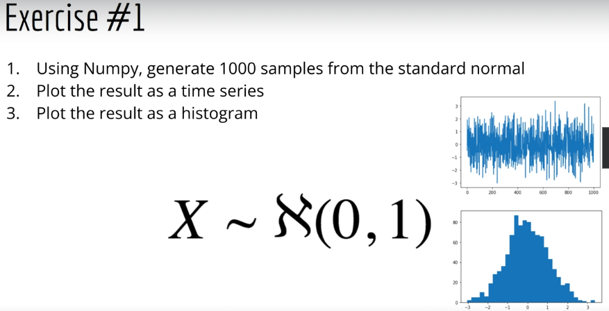

# Udemy - Financial engineering

## Introduction and outline

Using Machine learning tools for financial purposes.

### Fundamentals

- Financial data
- Stock prices and stock returns

Correlation between stock returns

### Time series analysis

- Prediction of tock prices
- Moving averages, Holt-winters, ARIMA.
- Efficient market hypotesis, Random walk hypotesis.
- Forecasting

Perfect prediction with LSTM can be too optimistic.

### Modern portfolio theory

- Diversification mitigates risk
- Investing in multiple stock is better

### Algorithimic trading

- Finding the best times to buy/sell
- Automation of buying and selling decisions

### How to practice

Each section shows how to implement a different part of the process:

1. Analysis of the distribution of stock returns
2. Time series modeling
3. Portfolio construction (optimization)
4. Algorithmic trading

In order to practice you can apply and replicate the same process to different datasets.

- Different markets
- Same data at different time frequencies

### Warmup

1. Use numpy to generate 1000 samples from the standard normal distribution
2. Plot the result as a time series
3. Plot the result as an histogram

4: use scipy or watever. Plot it as a scatter plot

# Code sources

Colab notebooks or github code. Notebooks are not on github.

[https://deeplearningcourses.com/notebooks/6azssSmffshcq8oRi8l7Gg](https://deeplearningcourses.com/notebooks/6azssSmffshcq8oRi8l7Gg)

[https://github.com/lazyprogrammer/financial_engineering](https://github.com/lazyprogrammer/financial_engineering)

https://docs.google.com/document/d/1ZWEA6tfaPm06DcQsRhf4GyX0WERt1d0rifVtuLbJuVc/edit

### Suggestions for the course

1. Use the Q&A to your advantage: understande the material and formulate questions/answers correctly
2. Meet the prerequisites
3. Do the exercises of the coding lectures. 

**403 errors for the files download:** drag and drop files in colab

# 1. Financial Basics

[Financial Basics](https://www.notion.so/Financial-Basics-eb873fd74f694641becef9c994e862b3?pvs=21)